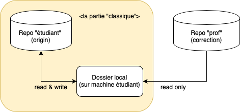

## Récupérer le code du prof avec Git remote

- une fois le repo "classroom" cloné
- par défaut, git a configuré le repo d'origine comme s'appelant "origin"
- on va rajouter une "remote" (un repo distant) pour brancher le projet local à 2 emplacement.
- le deuxième remote, on va l'appeler "correction"

## liste de commandes

- `git remote add correction <adresseDuRepoProf>`. Et voilà, c'est fait !
- pour récupérer la correction : `git pull correction master`
- pour éviter les conflits : `git pull --force correction master`
- si on a l'erreur "refusing to merge unrelated histories" : `git pull --allow-unrelated-histories correction master` (oui, cette option est relou à écrire...)
- l'étudiant continue à push sur son repo comme d'hab ! (`git push` ou `git push origin master`)