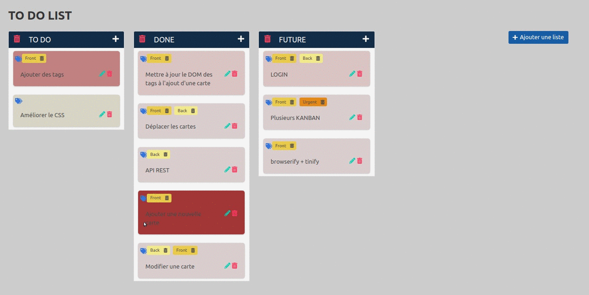

# 2022-S06-TO DO LIST
To do List using PostgreSQL, drag and drop...

## How to start ?
1. Create BDD
2. Create .env with BDD configuration
3. Run sql scripts in app/data
4. npm i
5. npm start

## How does it look ?

